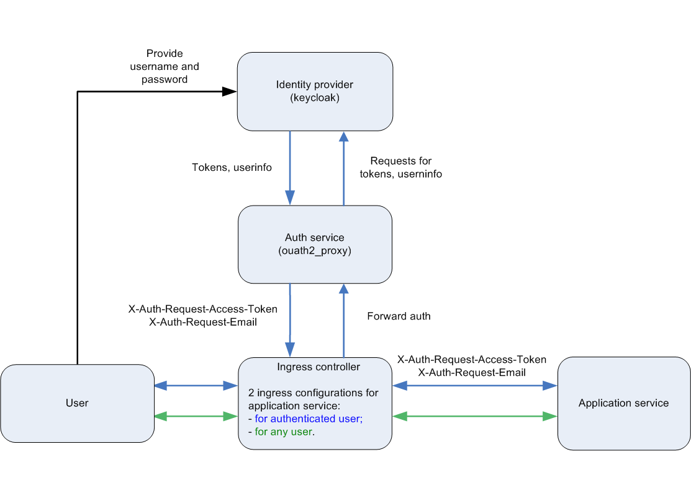

Backend for frontends. Apigateway
Добавить в приложение аутентификацию и регистрацию пользователей.

Реализовать сценарий "Изменение и просмотр данных в профиле клиента".
Пользователь регистрируется. Заходит под собой и по определенному урлу получает данные о своем профиле. Может поменять данные в профиле. Данные профиля для чтения и редактирования не должны быть доступны другим клиентам (аутентифицированным или нет).

На выходе должны быть
0) описание архитектурного решения и схема взаимодействия сервисов (в виде картинки)
1) команда установки приложения (из helm-а или из манифестов). Обязательно указать в каком namespace нужно устанавливать.
1*) команда установки api-gateway, если он отличен от nginx-ingress.
2) тесты постмана, которые прогоняют сценарий:
- регистрация пользователя 1
- проверка, что изменение и получение профиля пользователя недоступно без логина
- вход пользователя 1
- изменение профиля пользователя 1
- проверка, что профиль поменялся
- выход* (если есть)
- регистрация пользователя 2
- вход пользователя 2
- проверка, что пользователь2 не имеет доступа на чтение и редактирование профиля пользователя1.

В тестах обязательно
- наличие {{baseUrl}} для урла
- использование домена arch.homework в качестве initial значения {{baseUrl}}
- использование сгенерированных случайно данных в сценарии
- отображение данных запроса и данных ответа при запуске из командной строки с помощью newman.

## Описание архитектурного решения.

С помощью 2-х конфигураций ingress controller предоставляются 2 API серверного приложения:
1. Не требуещее идентификации и аутентификации пользователя и позволяещее получить информацию о состоянии эксземпляра приложения,
   конфигурации приложения, перейти на главную страницу, создать нового пользователя, перейти на страницу, инициирующую
   процедуру идентификации и аутентификации (не является обязательной, т.к. аналогичное поведение любого метода
   2-ого API).
2. Требующее идентификацию и аутентификацию пользователя и позволяющее получить информацию только о своем аккаунте,
   отредактировать данные только своего аккаунта, удалить свой аккаунт, завершить сессию серверного приложения.

Идентификация и аутентификация пользователя осуществляется с помощью внешнего identity provider - Keycloak.
Запросы пользователя к API, требующие аутентификации, перенаправляются в сервис аутентификации, в роли которого
используется oauth2_proxy. Если пользователь ранее не аутентифицировался, то он перенаправляется в Keycloak
для ввода логина и пароля. После успешной идентификации и аутентификации в Keycloak пользователь перенаправляется
обратно в сервис аутентификации oauth2_proxy, который завершает процедуру создания аутентифицированной сессии
для пользователя, получая токены от Keycloak. Далее oauth2_proxy отвечает на первоначальный запрос, добавляя
в заголовок ответа X-Auth-Request-Access-Token, X-Auth-Request-Email. Запрос попадает на обработку в 
серверное приложение, которое верифицирует JWT из заголовка X-Auth-Request-Access-Token. Идентификация пользователя
в серверном приложении выполняется с помощью email из JWT, поэтому этот атрибут аккаунта запрещен для редактирования
и должен быть уникальным.

Для корректной работы тестов после вызовов методов создания аккаунта, логина и перед логаутом для серверного приложения
выполняются соответствующие вызову методов для Keycloak.

## Схема взаимодействия сервисов.

## Инструкция по настройке и использованию.

1. kubectl create namespace hw

2. kubectl config set-context --current --namespace=hw

3. helm install hw-keycloak ./keycloak-chart/ --atomic

4. Добавить в /etc/hosts запись для keycloak с указанием ip адреса minikube
   x.x.x. keycloak

5. Настроить keycloak, создав realm и client. По умолчанию логин и пароль: admin. Ссылка для входа в admin console: https://keycloak/auth/

6. Создать realm:
     Name: hw-ext-auth
     Enabled: on

7. Создать client:
     Client ID: hw-auth-app
     Client Protocol: openid-connect
     Root URL: http://arch.homework/oauth2/callback

8. Настроить только что созданный client, сохранив изменения:
     Settings -> Access type: confidential
              -> Service Accounts Enabled: On
              -> Authorization Enabled: On

9. Сконфигурировать oauth2_proxy для доступа к keycloak.
   Выполнить команду, заменив в ней '???' на значение поля Secret из раздела Credentials для соданного ранее client:
   sed -i "s/KEYCLOAK_CLIENT_SECRET/???/" ./oauth2-proxy-chart/values.yaml

10. Сконфигурировать приложение для верификации JWT.
    Выполнить команду, заменив в ней '???' на значение Public key для алгоритма RS256 из раздела Realm settings -> Keys -> Active для соданного ранее realm:
    sed -i "s#KEYCLOAK_PUBLIC_KEY#???#" ./app/hw-app-chart/values.yaml

10. helm install hw-oauth ./oauth2-proxy-chart/ --atomic

11. helm install hw-app ./app/hw-app-chart/ --atomic

12. Запустить тесты с помощью команды:
    newman run ./tests/Otus.SoftwareArchitect.HW5.postman_collection.json --insecure

